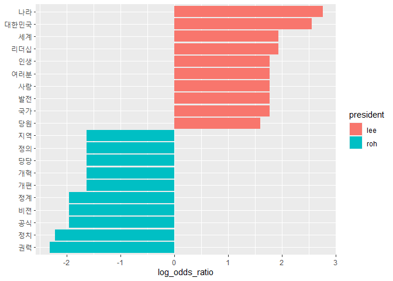
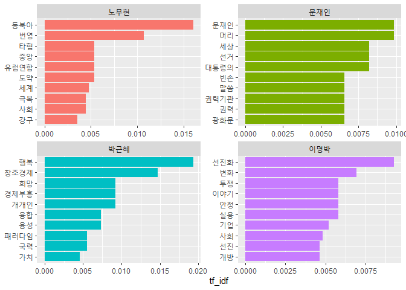

Quiz Part 3
===========

#### Q1. 역대 대통령의 대선 출마 선언문을 담은 `speeches_presidents.csv`를 이용해 문제를 해결해 보세요.

-   [Q1.1 다음 코드를 실행해 `speeches_presidents.csv`를 불러온 다음
    이명박 전 대통령과 노무현 전 대통령의 연설문을 추출하고 분석에
    적합하게 전처리하세요.](#Q1.1)
-   [Q1.2 연설문에서 명사를 추출한 다음 연설문별 단어 빈도를
    구하세요.](#Q1.2)
-   [Q1.3 로그 오즈비를 이용해 두 연설문에서 상대적으로 중요한 단어를
    10개씩 추출하세요.](#Q1.3)
-   [Q1.4 두 연설문에서 상대적으로 중요한 단어를 나타낸 막대 그래프를
    만드세요.](#Q1.4)

#### Q2. 역대 대통령의 취임사를 담은 `inaugural_address.csv`를 이용해 문제를 해결해 보세요.

-   [Q2.1 다음 코드를 실행해 `inaugural_address.csv`를 불러온 다음
    분석에 적합하게 전처리하고 연설문에서 명사를 추출하세요.](#Q2.1)
-   [Q2.2 TF-IDF를 이용해 각 연설문에서 상대적으로 중요한 단어를 10개씩
    추출하세요.](#Q2.2)
-   [Q2.3 각 연설문에서 상대적으로 중요한 단어를 나타낸 막대 그래프를
    만드세요.](#Q2.3)

------------------------------------------------------------------------

#### Q1. 역대 대통령의 대선 출마 선언문을 담은 `speeches_presidents.csv`를 이용해 문제를 해결해 보세요.<a name="Q1"></a>

<br>

#### Q1.1 다음 코드를 실행해 `speeches_presidents.csv`를 불러온 다음 이명박 전 대통령과 노무현 전 대통령의 연설문을 추출하고 분석에 적합하게 전처리하세요.<a name="Q1.1"></a>

``` r
install.packages("readr")
library(readr)
raw_speeches <- read_csv("speeches_presidents.csv")
```

> `read_csv()`는 데이터를 다루기 편한 tibble 구조로 만들어 주고 데이터를
> 불러오는 속도도 `read.csv()`보다 빠릅니다.

``` r
library(dplyr)
library(stringr)
speeches <- raw_speeches %>%
  filter(president %in% c("이명박", "노무현")) %>%
  mutate(value = str_replace_all(value, "[^가-힣]", " "),
         value = str_squish(value))

speeches
```

    ## # A tibble: 2 x 2
    ##   president value                                                               
    ##   <chr>     <chr>                                                               
    ## 1 이명박    존경하는 국민 여러분 사랑하는 한나라당 당원 동지 여러분 저는 오늘 무거운 책임감을 갖고 이 자리에 섰습니다 이 문명사적~
    ## 2 노무현    어느때인가 부터 제가 대통령이 되겠다고 말을 하기 시작했습니다 많은 분들이 제게 무엇을 했느냐 를 묻지 않고 무엇을 하겠~

------------------------------------------------------------------------

#### Q1.2 연설문에서 명사를 추출한 다음 연설문별 단어 빈도를 구하세요.<a name="Q1.2"></a>

##### 명사 추출

``` r
library(tidytext)
library(KoNLP)
speeches <- speeches %>%
  unnest_tokens(input = value,
                output = word,
                token = extractNoun)

speeches
```

    ## # A tibble: 1,002 x 2
    ##    president word  
    ##    <chr>     <chr> 
    ##  1 이명박    존경  
    ##  2 이명박    하    
    ##  3 이명박    국민  
    ##  4 이명박    여러분
    ##  5 이명박    사랑  
    ##  6 이명박    하    
    ##  7 이명박    한나라
    ##  8 이명박    당    
    ##  9 이명박    당원  
    ## 10 이명박    동지  
    ## # ... with 992 more rows

##### 연설문별 단어 빈도 구하기

``` r
frequency <- speeches %>%
  count(president, word) %>%
  filter(str_count(word) > 1)

frequency
```

    ## # A tibble: 418 x 3
    ##    president word      n
    ##    <chr>     <chr> <int>
    ##  1 노무현    가슴      2
    ##  2 노무현    가훈      2
    ##  3 노무현    갈등      1
    ##  4 노무현    감옥      1
    ##  5 노무현    강자      1
    ##  6 노무현    개편      4
    ##  7 노무현    개혁      4
    ##  8 노무현    건국      1
    ##  9 노무현    경선      1
    ## 10 노무현    경쟁      1
    ## # ... with 408 more rows

------------------------------------------------------------------------

#### Q1.3 로그 오즈비를 이용해 두 연설문에서 상대적으로 중요한 단어를 10개씩 추출하세요.<a name="Q1.3"></a>

##### long form을 wide form으로 변환

``` r
library(tidyr)
frequency_wide <- frequency %>%
  pivot_wider(names_from = president,     # 변수명으로 만들 값
              values_from = n,            # 변수에 채워 넣을 값
              values_fill = list(n = 0))  # 결측치 0으로 변환

frequency_wide
```

    ## # A tibble: 382 x 3
    ##    word  노무현 이명박
    ##    <chr>  <int>  <int>
    ##  1 가슴       2      0
    ##  2 가훈       2      0
    ##  3 갈등       1      0
    ##  4 감옥       1      0
    ##  5 강자       1      0
    ##  6 개편       4      0
    ##  7 개혁       4      0
    ##  8 건국       1      0
    ##  9 경선       1      0
    ## 10 경쟁       1      3
    ## # ... with 372 more rows

##### 로그 오즈비 구하기

``` r
frequency_wide <- frequency_wide %>%
  mutate(log_odds_ratio = log(((이명박 + 1) / (sum(이명박 + 1))) /
                              ((노무현 + 1) / (sum(노무현 + 1)))))

frequency_wide
```

    ## # A tibble: 382 x 4
    ##    word  노무현 이명박 log_odds_ratio
    ##    <chr>  <int>  <int>          <dbl>
    ##  1 가슴       2      0         -1.12 
    ##  2 가훈       2      0         -1.12 
    ##  3 갈등       1      0         -0.710
    ##  4 감옥       1      0         -0.710
    ##  5 강자       1      0         -0.710
    ##  6 개편       4      0         -1.63 
    ##  7 개혁       4      0         -1.63 
    ##  8 건국       1      0         -0.710
    ##  9 경선       1      0         -0.710
    ## 10 경쟁       1      3          0.676
    ## # ... with 372 more rows

##### 상대적으로 중요한 단어 추출

``` r
top10 <- frequency_wide %>%
  group_by(president = ifelse(log_odds_ratio > 0, "lee", "roh")) %>%
  slice_max(abs(log_odds_ratio), n = 10, with_ties = F)

top10
```

    ## # A tibble: 20 x 5
    ## # Groups:   president [2]
    ##    word     노무현 이명박 log_odds_ratio president
    ##    <chr>     <int>  <int>          <dbl> <chr>    
    ##  1 나라          0     15           2.76 lee      
    ##  2 대한민국      0     12           2.55 lee      
    ##  3 세계          1     13           1.93 lee      
    ##  4 리더십        0      6           1.93 lee      
    ##  5 여러분        1     11           1.77 lee      
    ##  6 국가          0      5           1.77 lee      
    ##  7 발전          0      5           1.77 lee      
    ##  8 사랑          0      5           1.77 lee      
    ##  9 인생          0      5           1.77 lee      
    ## 10 당원          0      4           1.59 lee      
    ## 11 권력          9      0          -2.32 roh      
    ## 12 정치          8      0          -2.21 roh      
    ## 13 공식          6      0          -1.96 roh      
    ## 14 비젼          6      0          -1.96 roh      
    ## 15 정계          6      0          -1.96 roh      
    ## 16 개편          4      0          -1.63 roh      
    ## 17 개혁          4      0          -1.63 roh      
    ## 18 당당          4      0          -1.63 roh      
    ## 19 정의          4      0          -1.63 roh      
    ## 20 지역          4      0          -1.63 roh

------------------------------------------------------------------------

#### Q1.4 두 연설문에서 상대적으로 중요한 단어를 나타낸 막대 그래프를 만드세요.<a name="Q1.4"></a>

``` r
library(ggplot2)
ggplot(top10, aes(x = reorder(word, log_odds_ratio),
                  y = log_odds_ratio,
                  fill = president)) +
  geom_col() +
  coord_flip () +
  labs(x = NULL)
```



------------------------------------------------------------------------

#### Q2. 역대 대통령의 취임사를 담은 `inaugural_address.csv`를 이용해 문제를 해결해 보세요.<a name="Q2"></a>

<br>

#### Q2.1 다음 코드를 실행해 `inaugural_address.csv`를 불러온 다음 분석에 적합하게 전처리하고 연설문에서 명사를 추출하세요.<a name="Q2.1"></a>

``` r
raw_speeches <- read_csv("inaugural_address.csv")
```

> 문재인 대통령의 취임사 출처:
> [bit.ly/easytext_34](https://bit.ly/easytext_34)

> 이명박, 박근혜, 노무현 전 대통령의 취임사 출처:
> [bit.ly/easytext_35](htts://bit.ly/easytext_35)

##### 전처리

``` r
library(dplyr)
library(stringr)
speeches <- raw_speeches %>%
  mutate(value = str_replace_all(value, "[^가-힣]", " "),
         value = str_squish(value))

speeches
```

    ## # A tibble: 4 x 2
    ##   president value                                                               
    ##   <chr>     <chr>                                                               
    ## 1 문재인    국민께 드리는 말씀 존경하고 사랑하는 국민 여러분 감사합니다 국민 여러분의 위대한 선택에 머리 숙여 깊이 감사드립니다 저~
    ## 2 박근혜    희망의 새 시대를 열겠습니다 존경하는 국민여러분 만 해외동포 여러분 저는 오늘 대한민국의 제 대 대통령에 취임하면서 희망~
    ## 3 이명박    존경하는 국민 여러분 만 해외동포 여러분 이 자리에 참석하신 노무현 김대중 김영삼 전두환 전 대통령 그리고 이슬람 카리모~
    ## 4 노무현    존경하는 국민 여러분 오늘 저는 대한민국의 제 대 대통령에 취임하기 위해 이 자리에 섰습니다 국민 여러분의 위대한 선택으~

##### 명사 기준 토큰화

``` r
library(tidytext)
library(KoNLP)
speeches <- speeches %>%
  unnest_tokens(input = value,
                output = word,
                token = extractNoun)

speeches
```

    ## # A tibble: 4,121 x 2
    ##    president word  
    ##    <chr>     <chr> 
    ##  1 문재인    국민  
    ##  2 문재인    말씀  
    ##  3 문재인    존경  
    ##  4 문재인    사랑  
    ##  5 문재인    하    
    ##  6 문재인    국민  
    ##  7 문재인    여러분
    ##  8 문재인    감사  
    ##  9 문재인    국민  
    ## 10 문재인    여러분
    ## # ... with 4,111 more rows

> 문재인 대통령의 취임사 출처:
> [bit.ly/easytext_34](https://bit.ly/easytext_34)

> 이명박, 박근혜, 노무현 전 대통령의 취임사 출처:
> [bit.ly/easytext_35](https://bit.ly/easytext_35)

------------------------------------------------------------------------

#### Q2.2 TF-IDF를 이용해 각 연설문에서 상대적으로 중요한 단어를 10개씩 추출하세요.<a name="Q2.2"></a>

##### 단어 빈도 구하기

``` r
frequecy <- speeches %>%
  count(president, word) %>%
  filter(str_count(word) > 1)

frequecy
```

    ## # A tibble: 1,657 x 3
    ##    president word       n
    ##    <chr>     <chr>  <int>
    ##  1 노무현    가난       1
    ##  2 노무현    가능       1
    ##  3 노무현    가일       1
    ##  4 노무현    가지       1
    ##  5 노무현    각국       1
    ##  6 노무현    갈등       1
    ##  7 노무현    갈림길     1
    ##  8 노무현    감사       4
    ##  9 노무현    강구       2
    ## 10 노무현    강국       1
    ## # ... with 1,647 more rows

##### TF-IDF 구하기

``` r
frequecy <- frequecy %>%
  bind_tf_idf(term = word,           # 단어
              document = president,  # 텍스트 구분 변수
              n = n) %>%             # 단어 빈도
  arrange(-tf_idf)

frequecy
```

    ## # A tibble: 1,657 x 6
    ##    president word         n      tf   idf  tf_idf
    ##    <chr>     <chr>    <int>   <dbl> <dbl>   <dbl>
    ##  1 박근혜    행복        21 0.0279  0.693 0.0193 
    ##  2 노무현    동북아      18 0.0231  0.693 0.0160 
    ##  3 박근혜    창조경제     8 0.0106  1.39  0.0147 
    ##  4 노무현    번영         6 0.00770 1.39  0.0107 
    ##  5 문재인    머리         3 0.00711 1.39  0.00986
    ##  6 문재인    문재인       3 0.00711 1.39  0.00986
    ##  7 이명박    선진화       8 0.00668 1.39  0.00927
    ##  8 박근혜    개개인       5 0.00663 1.39  0.00919
    ##  9 박근혜    경제부흥     5 0.00663 1.39  0.00919
    ## 10 박근혜    희망        10 0.0133  0.693 0.00919
    ## # ... with 1,647 more rows

##### 상대적으로 중요한 단어 추출

``` r
top10 <- frequecy %>%
  group_by(president) %>%
  slice_max(tf_idf, n = 10, with_ties = F)

top10
```

    ## # A tibble: 40 x 6
    ## # Groups:   president [4]
    ##    president word         n      tf   idf  tf_idf
    ##    <chr>     <chr>    <int>   <dbl> <dbl>   <dbl>
    ##  1 노무현    동북아      18 0.0231  0.693 0.0160 
    ##  2 노무현    번영         6 0.00770 1.39  0.0107 
    ##  3 노무현    도약         3 0.00385 1.39  0.00534
    ##  4 노무현    유럽연합     3 0.00385 1.39  0.00534
    ##  5 노무현    중앙         3 0.00385 1.39  0.00534
    ##  6 노무현    타협         3 0.00385 1.39  0.00534
    ##  7 노무현    세계        13 0.0167  0.288 0.00480
    ##  8 노무현    극복         5 0.00642 0.693 0.00445
    ##  9 노무현    사회        12 0.0154  0.288 0.00443
    ## 10 노무현    강구         2 0.00257 1.39  0.00356
    ## # ... with 30 more rows

------------------------------------------------------------------------

#### Q2.3 각 연설문에서 상대적으로 중요한 단어를 나타낸 막대 그래프를 만드세요.<a name="Q2.3"></a>

``` r
library(ggplot2)
ggplot(top10, aes(x = reorder_within(word, tf_idf, president),
                  y = tf_idf,
                  fill = president)) +
  geom_col(show.legend = F) +
  coord_flip () +
  facet_wrap(~ president, scales = "free", ncol = 2) +
  scale_x_reordered() +
  labs(x = NULL)
```


