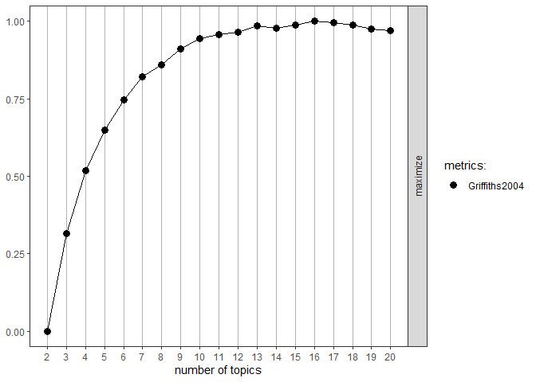
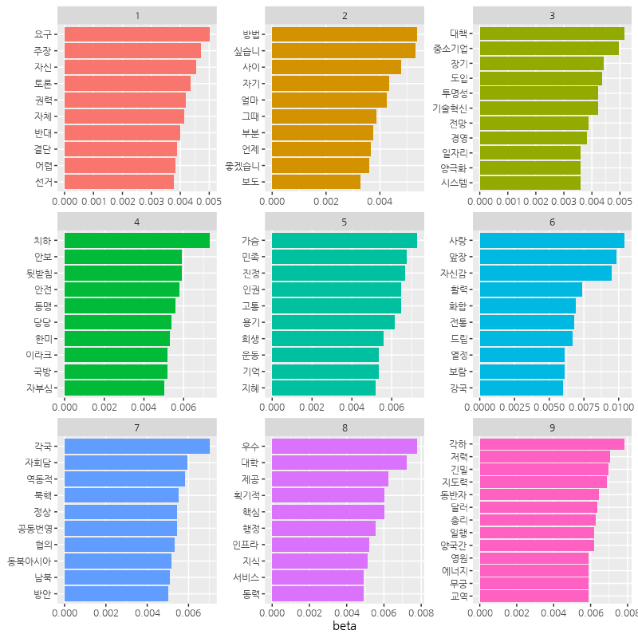

Quiz Part 6
===========

#### `speeches_roh.csv`에는 노무현 전 대통령의 연설문 780개가 들어있습니다. `speeches_roh.csv`를 이용해 문제를 해결해 보세요.

[Q1. `speeches_roh.csv`를 불러온 다음 연설문이 들어있는 `content`를 문장
기준으로 토큰화하세요.](#Q1)

[Q2. 문장을 분석에 적합하게 전처리한 다음 명사를 추출하세요.](#Q2)

[Q3. 연설문 내 중복 단어를 제거하고 빈도가 100회 이하인 단어를
추출하세요.](#Q3)

[Q4. 추출한 단어에서 다음의 불용어를 제거하세요.](#Q4)

[Q5. 연설문별 단어 빈도를 구한 다음 DTM을 만드세요.](#Q5)

[Q6. 토픽 수를 2\~20개로 바꿔가며 LDA 모델을 만든 다음 최적 토픽 수를
구하세요.](#Q6)

[Q7. 토픽 수가 9개인 LDA 모델을 추출하세요.](#Q7)

[Q8. LDA 모델의 beta를 이용해 각 토픽에 등장할 확률이 높은 상위 10개
단어를 추출한 다음 토픽별 주요 단어를 나타낸 막대 그래프를
만드세요.](#Q8)

[Q9. LDA 모델의 gamma를 이용해 연설문 원문을 확률이 가장 높은 토픽으로
분류하세요.](#Q9)

[Q10. 토픽별 문서 수를 출력하세요.](#Q10)

[Q11. 문서가 가장 많은 토픽의 연설문을 gamma가 높은 순으로 출력하고
내용이 비슷한지 살펴보세요.](#Q11)

------------------------------------------------------------------------

#### Q1. `speeches_roh.csv`를 불러온 다음 연설문이 들어있는 `content`를 문장 기준으로 토큰화하세요.<a name="Q1"></a>

##### 연설문 불러오기

``` r
library(readr)
speeches_raw <- read_csv("speeches_roh.csv")
```

##### 문장 기준 토큰화

``` r
library(dplyr)
library(tidytext)
speeches <- speeches_raw %>%
  unnest_tokens(input = content,
                output = sentence,
                token = "sentences",
                drop = F)
```

> `KoNLP` 패키지의 함수는 토큰화할 텍스트가 너무 길면 오류가 발생합니다.
> 텍스트를 문장 기준으로 토큰화하고 나서 다시 명사 기준으로 토큰화하면
> 이런 문제를 피할 수 있습니다.

> 노무현 전 대통령의 연설문 출처:
> [bit.ly/easytext_35](https://bit.ly/easytext_35)

------------------------------------------------------------------------

#### Q2. 문장을 분석에 적합하게 전처리한 다음 명사를 추출하세요.<a name="Q2"></a>

``` r
# 전처리
library(stringr)
speeches <- speeches %>%
  mutate(sentence = str_replace_all(sentence, "[^가-힣]", " "),
         sentence = str_squish(sentence))
```

``` r
# 명사 추출
library(tidytext)
library(KoNLP)
library(stringr)
nouns_speeches <- speeches %>%
  unnest_tokens(input = sentence,
                output = word,
                token = extractNoun,
                drop = F) %>%
  filter(str_count(word) > 1)
```

> 컴퓨터 성능에 따라 명사를 추출하는 데 시간이 오래 걸릴 수 있습니다.

------------------------------------------------------------------------

#### Q3. 연설문 내 중복 단어를 제거하고 빈도가 100회 이하인 단어를 추출하세요.<a name="Q3"></a>

##### 연설문 내 중복 단어 제거

``` r
nouns_speeches <- nouns_speeches %>%
  group_by(id) %>%
  distinct(word, .keep_all = T) %>%
  ungroup()
```

##### 단어 빈도 100회 이하 단어 추출

``` r
nouns_speeches <- nouns_speeches %>%
  add_count(word) %>%
  filter(n <= 100) %>%
  select(-n)
```

------------------------------------------------------------------------

#### Q4. 추출한 단어에서 다음의 불용어를 제거하세요.<a name="Q4"></a>

``` r
stopword <- c("들이", "하다", "하게", "하면", "해서", "이번", "하네",
              "해요", "이것", "니들", "하기", "하지", "한거", "해주",
              "그것", "어디", "여기", "까지", "이거", "하신", "만큼")
```

``` r
nouns_speeches <- nouns_speeches %>%
  filter(!word %in% stopword)
```

------------------------------------------------------------------------

#### Q5. 연설문별 단어 빈도를 구한 다음 DTM을 만드세요.<a name="Q5"></a>

##### 연설문별 단어 빈도 구하기

``` r
count_word_doc <- nouns_speeches %>%
  count(id, word, sort = T)
```

##### DTM 만들기

``` r
dtm_comment <- count_word_doc %>%
  cast_dtm(document = id, term = word, value = n)
```

------------------------------------------------------------------------

#### Q6. 토픽 수를 2\~20개로 바꿔가며 LDA 모델을 만든 다음 최적 토픽 수를 구하세요.<a name="Q6"></a>

##### 토픽 수 바꿔가며 LDA 모델 만들기

``` r
library(ldatuning)
models <- FindTopicsNumber(dtm = dtm_comment,
                           topics = 2:20,
                           return_models = T,
                           control = list(seed = 1234))
```

##### 최적 토픽 수 구하기

``` r
FindTopicsNumber_plot(models)
```



------------------------------------------------------------------------

#### Q7. 토픽 수가 9개인 LDA 모델을 추출하세요.<a name="Q7"></a>

``` r
lda_model <- models %>%
  filter (topics == 9) %>%
  pull(LDA_model) %>%
 .[[1]]
```

------------------------------------------------------------------------

#### Q8. LDA 모델의 beta를 이용해 각 토픽에 등장할 확률이 높은 상위 10개 단어를 추출한 다음 토픽별 주요 단어를 나타낸 막대 그래프를 만드세요.<a name="Q8"></a>

##### beta 추출

``` r
term_topic <- tidy(lda_model, matrix = "beta")
```

##### 토픽별 beta 상위 단어 추출

``` r
top_term_topic <- term_topic %>%
  group_by(topic) %>%
  slice_max(beta, n = 10)
```

##### 막대 그래프 만들기

``` r
library(ggplot2)
ggplot(top_term_topic,
       aes(x = reorder_within(term, beta, topic),
           y = beta,
           fill = factor(topic))) +
  geom_col(show.legend = F) +
  facet_wrap(~ topic, scales = "free", ncol = 3) +
  coord_flip () +
  scale_x_reordered() +
  labs(x = NULL)
```



------------------------------------------------------------------------

#### Q9. LDA 모델의 gamma를 이용해 연설문 원문을 확률이 가장 높은 토픽으로 분류하세요.<a name="Q9"></a>

##### gamma 추출

``` r
doc_topic <- tidy(lda_model, matrix = "gamma")
```

##### 문서별로 확률이 가장 높은 토픽 추출

``` r
doc_class <- doc_topic %>%
  group_by(document) %>%
  slice_max(gamma, n = 1)
```

##### 변수 타입 통일

``` r
doc_class$document <- as.integer(doc_class$document)
```

##### 연설문 원문에 확률이 가장 높은 토픽 번호 부여

``` r
speeches_topic <- speeches_raw %>%
  left_join(doc_class, by = c("id" = "document"))
```

------------------------------------------------------------------------

#### Q10. 토픽별 문서 수를 출력하세요.<a name="Q10"></a>

``` r
speeches_topic %>%
  count(topic)
```

    ## # A tibble: 9 x 2
    ##   topic     n
    ##   <int> <int>
    ## 1     1    67
    ## 2     2    44
    ## 3     3    62
    ## 4     4    71
    ## 5     5    84
    ## 6     6   134
    ## 7     7    84
    ## 8     8   119
    ## 9     9   148

------------------------------------------------------------------------

#### Q11. 문서가 가장 많은 토픽의 연설문을 gamma가 높은 순으로 출력하고 내용이 비슷한지 살펴보세요.<a name="Q11"></a>

``` r
speeches_topic %>%
  filter(topic == 9) %>%
  arrange(-gamma) %>%
  select(content)
```

    ## # A tibble: 148 x 1
    ##    content                                                                      
    ##    <chr>                                                                        
    ##  1 안녕하십니까, 이처럼 따뜻하게 맞아주셔서 감사합니다. 나지모프 대외경제청장과 김용구 중소기업중앙회장을 비롯한 양국 경제인 여러분께 감사드~
    ##  2 존경하는 룰라 대통령 각하 내외분, 그리고 귀빈 여러분, 오늘 저녁, BRICs 국가로 세계의 주목을 받고 있는 브라질의 귀한 손님을 모~
    ##  3 존경하는 압델아지즈 부테플리카 알제리 대통령 각하, 그리고 내외 귀빈 여러분, 나와 우리 일행을 따뜻하게 맞아주신 각하와 알제리 국민 여~
    ##  4 존경하는 압둘 라흐만 알 라쉬드 상의연합회 회장, 압둘 라흐만 알 안카리 경협위원장, 손경식 대한상의 회장, 김선동 경협위원장, 그리고 ~
    ##  5 존경하는 바세스쿠 대통령 각하, 그리고 귀빈 여러분, 각하와 일행 여러분의 방한을 진심으로 환영합니다. 먼저, 루마니아가 올해 수차례의 ~
    ##  6 존경하는 일함 알리예프 대통령 각하 내외분, 그리고 귀빈 여러분, 나와 우리 일행을 환대해 주신 각하 내외분께 감사드립니다. 대한민국 대~
    ##  7 존경하는 키르츠네르 대통령 각하 내외분, 그리고 귀빈 여러분, 우리 내외와 일행에 대한 환대에 감사드립니다. 부에노스 아이레스는 매우 아~
    ##  8 존경하는,카리모프, 대통령 각하 내외분, 그리고 귀빈 여러분, 각하 내외분과 일행 여러분을 진심으로 환영합니다. 오늘 이 자리가 양국의 ~
    ##  9 2005년 5월 10일 존경하는 카리모프 대통령 각하 내외분, 그리고 귀빈 여러분, 우리 내외와 일행을 환대해주시고, 성대한 만찬을 베풀~
    ## 10 존경하는 빌토르 바비욱 루마니아 상공회의소 회장, 그리고 손경식 대한상의 회장을 비롯한 양국 경제계 지도자 여러분, 안녕하십니까, 이렇게~
    ## # ... with 138 more rows
